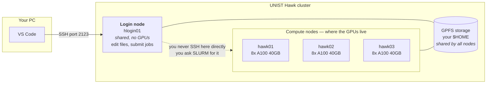
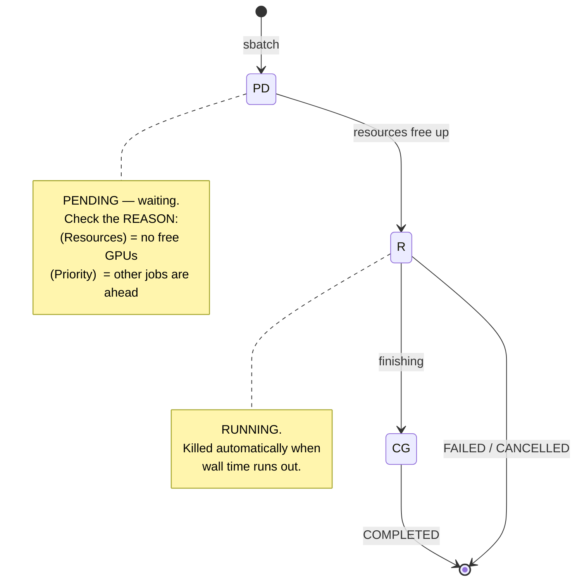
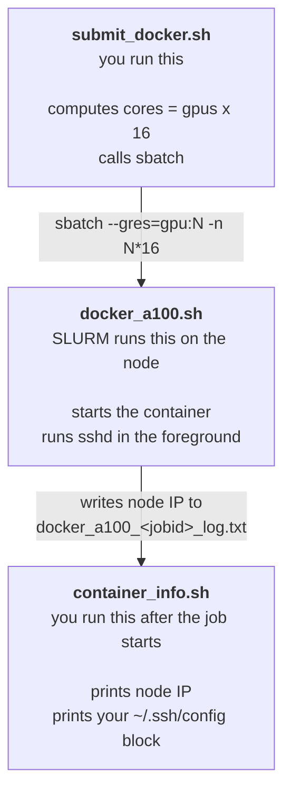
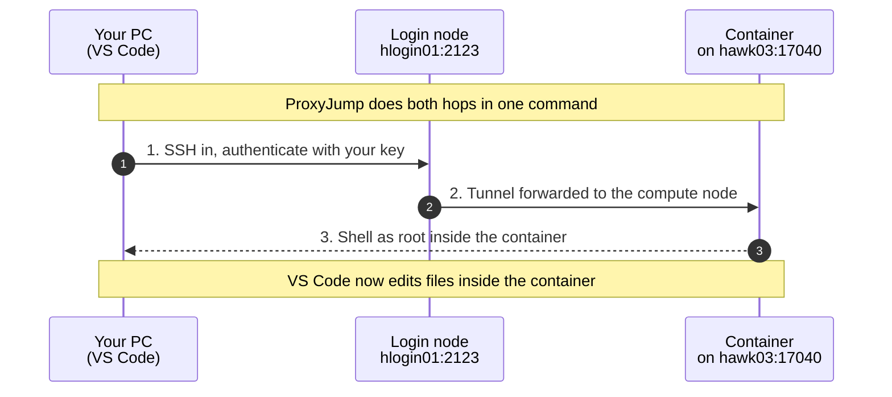
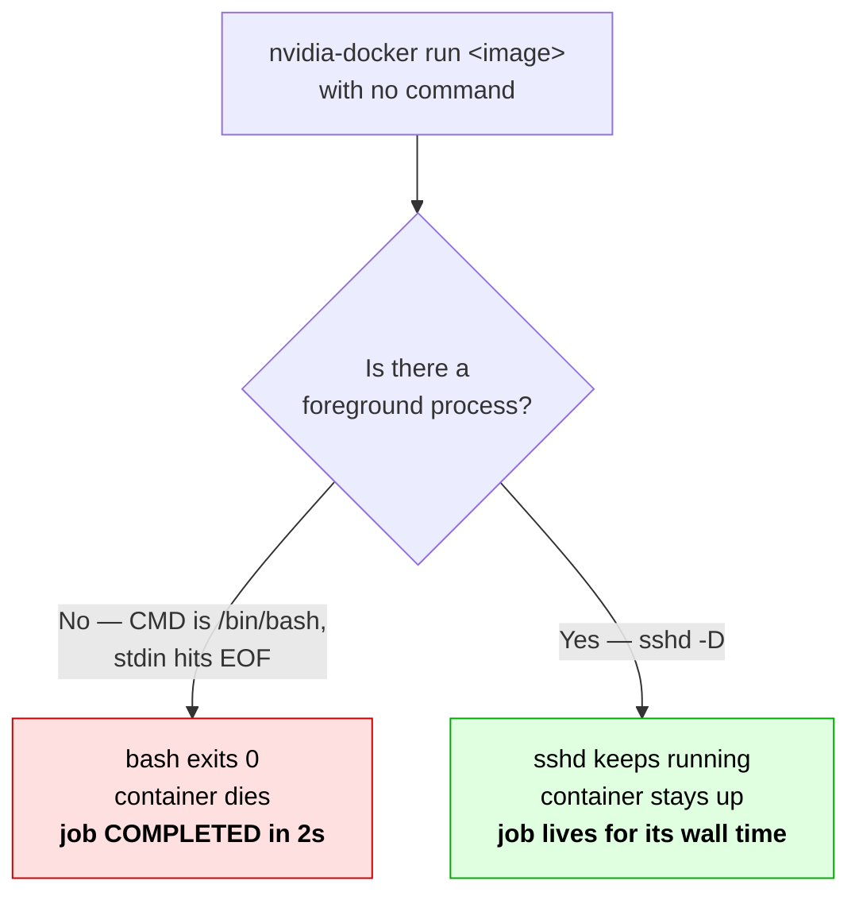

# Running NVIDIA Containers on the UNIST Supercomputing Center (Hawk)

Get a Docker container running on an A100 GPU node, then attach **VS Code** to it over SSH — so you can develop inside the container as if it were your own machine.

> **Who this is for:** people who have a UNIST Supercomputing Center account but have never used SLURM, a job scheduler, or an HPC cluster before. No prior experience assumed.
>
> **What this is:** a working set of scripts plus the reasoning behind them. Everything here was verified on the Hawk cluster. Where the official manual turned out to be wrong or incomplete, that is called out explicitly.

### Verifying these notes

Do not take this README on faith — it is community notes, and the cluster changes.

1. **Against the official guide.** `UNIST Hawk HPC user guide - ver03.pdf` is included in this repo for reference, and page numbers are cited throughout so you can check each claim. It is the Supercomputing Center's document, not ours; treat the copy the center gives you as authoritative, since versions move on.
2. **Against the live cluster — stronger.** Every factual claim here came from a command you can re-run yourself:

   ```bash
   scontrol show node hawk03                                    # GPUs actually in use
   sacctmgr show assoc user=$USER format=GrpTRESMins,MaxWall,QOS  # your real limits
   sinfo -p a100_40g -N -l                                      # which nodes are alive
   nvidia-docker inspect --format='{{json .Config.Cmd}}' <image>  # what the image really runs
   ```

   If a number here disagrees with your terminal, **your terminal is right.** Please open an issue.

---

## Table of contents

- [The 60-second version](#the-60-second-version)
- [What a cluster actually is](#what-a-cluster-actually-is)
- [SLURM in five minutes](#slurm-in-five-minutes)
- [The scripts](#the-scripts)
- [Step-by-step walkthrough](#step-by-step-walkthrough)
- [How SSH into the container works](#how-ssh-into-the-container-works)
- [Windows: the one setting you must change](#windows-the-one-setting-you-must-change)
- [Why the container needs sshd started manually](#why-the-container-needs-sshd-started-manually)
- [Troubleshooting](#troubleshooting)
- [Pitfalls we hit so you don't have to](#pitfalls-we-hit-so-you-dont-have-to)
- [Command reference](#command-reference)
- [Known manual inconsistencies](#known-manual-inconsistencies)

---

## The 60-second version

```bash
# On the login node (hlogin01)

# 0. ONE TIME: add your PC's public key to the cluster.
#    Do this BEFORE submitting. Adding it later forces a resubmit,
#    and a resubmit means losing your GPU slot.
cat >> ~/.ssh/authorized_keys   # paste your PC's id_ed25519.pub, then Ctrl-D

# 1. Submit a job asking for 1 GPU
bash submit_docker.sh 1

# 2. Wait until state is R (running)
squeue -u $USER

# 3. Print the node IP and a ready-to-paste SSH config
bash container_info.sh

# 4. Verify from the login node first
ssh -i ~/.ssh/id_rsa -p 17040 root@<node_ip>
```

Then paste the printed block into `~/.ssh/config` **on your own PC** and connect with VS Code Remote-SSH.

---

## What a cluster actually is

If you have only ever used a single machine, this is the mental model shift:



Three rules that follow from this picture:

1. **The login node has no GPUs.** Never run training there. It is for editing, submitting, and checking on jobs.
2. **You cannot just SSH into a compute node.** You ask the scheduler (SLURM) for one, and it hands you a slot when resources are free.
3. **`$HOME` is shared across every node.** A file you write on the login node is instantly visible on `hawk03`. This is why mounting `~/.ssh/authorized_keys` into the container works.

---

## SLURM in five minutes

SLURM is the queue manager. You do not run programs — you **submit jobs** and SLURM decides when and where they run.

### The job lifecycle



`squeue` shows a status code (`ST`) for each job:

| Code | Meaning |
|:--|:--|
| `PD` | Pending — queued, waiting for resources |
| `R` | Running |
| `CG` | Completing — finishing up |

And when `PD`, the `NODELIST(REASON)` column tells you why:

| Reason | What it means | What to do |
|:--|:--|:--|
| `(Resources)` | Every GPU is busy | Wait. Nothing you can do. |
| `(Priority)` | Other jobs are ahead of you | Wait. See [pitfall 4](#4-you-cannot-buy-your-way-up-the-queue). |
| `(Dependency)` | Waiting on another job to finish | Expected if you used `--dependency` |
| `(ReqNodeNotAvail)` | Requested node is down or reserved | Check `sinfo` |

### What you are charged for

**Nothing is deducted.** There is no GPU-hour budget on this cluster — verified with `sacctmgr`. What exists instead are *concurrency* limits:

| Account | Max GPUs at once | Max wall time per job |
|:--|:--|:--|
| `ngpu` (default) | 8 | 12 hours |
| `Lgpu` | 2 | 300 hours |

You can run jobs all day. You just cannot hold more than 8 GPUs simultaneously, and any single job is killed at 12 hours.

### The cluster's hard rules

| Rule | Detail |
|:--|:--|
| Partition | `a100_40g` |
| CPU:GPU ratio | **16 cores per GPU.** Ask for more and your job pends forever. |
| Memory | 128 GB per GPU |
| Wall time | Mandatory. A job with no `--time` will not run. |
| GPU count | Must be ≥ 1. `--gres=gpu:0` is **rejected** on this partition. |
| Docker | One container per SLURM job. Single node only. |

---

## The scripts

Three files, each with one job:



Why the split? SLURM reads `#SBATCH` lines as **plain text before any shell runs**, so you cannot compute `16 × N` inside them. Command-line options override `#SBATCH` directives, so `submit_docker.sh` does the arithmetic and passes the result in.

---

## Step-by-step walkthrough

### 0. Register your PC's public key — do this first

On **your PC**:

```bash
# Create a key if you do not have one
ssh-keygen -t ed25519 -C "mypc"

# Print the PUBLIC half (never share the file without .pub)
cat ~/.ssh/id_ed25519.pub          # macOS / Linux
```
```powershell
Get-Content $env:USERPROFILE\.ssh\id_ed25519.pub    # Windows PowerShell
```

Append that one line to `~/.ssh/authorized_keys` **on the cluster**. Keep any existing keys — the cluster puts its own `root@hmgmt.cluster.com` key there and it is needed internally.

```bash
# On the login node — verify both keys are present
ssh-keygen -l -f ~/.ssh/authorized_keys
```

> **Why first?** The container copies `authorized_keys` at startup. Add a key afterwards and you must resubmit the job to pick it up — and resubmitting means going to the back of the queue. We learned this the expensive way.

### 1. Submit

```bash
bash submit_docker.sh 1     # 1 GPU, 16 cores
```

Passing no argument defaults to **8 GPUs**, which needs an entire node to free up. Use `1` unless you really need more.

### 2. Watch the queue

```bash
squeue -u $USER
```

```
JOBID  PARTITION  NAME       USER     ST  TIME  NODES NODELIST(REASON)
20450  a100_40g   docker_a1  yourid   R   0:15  1     hawk03
```

Wait for `ST` to become `R`. If it sits at `PD`, read the reason column.

### 3. Get your connection details

```bash
bash container_info.sh
```

```
===============================================
 JobID        : 20450
 compute node : hawk03
 node IP      : 172.30.0.13
 time left    : 11:44:11
===============================================
```

### 4. Test from the login node before touching VS Code

```bash
ssh -i ~/.ssh/id_rsa -p 17040 root@172.30.0.13
```

If this fails, VS Code will also fail. Fix it here first — the error messages are much clearer.

### 5. Connect VS Code

Paste the config block from step 3 into `~/.ssh/config` on your PC, then pick the host in VS Code Remote-SSH.

**The node IP changes every time you resubmit.** Re-run `container_info.sh` and update `HostName` each time.

---

## How SSH into the container works

Compute nodes sit on a private network (`172.30.x.x`). Your PC cannot reach them directly, so you hop through the login node using `ProxyJump`.



Your `~/.ssh/config` on your PC:

```
Host hawk-login
    HostName 10.0.7.71
    Port 2123
    User <your_id>

Host hawk-container
    HostName <node_ip_from_container_info.sh>
    Port 17040
    User root
    ProxyJump hawk-login
    StrictHostKeyChecking no
    UserKnownHostsFile /dev/null
```

`StrictHostKeyChecking no` and `UserKnownHostsFile /dev/null` stop SSH from complaining every time you land on a different node — which happens constantly, since each job may be scheduled anywhere.

The container runs as **root** on port **17040**.

---

## Windows: the one setting you must change

If `ssh` works from the login node but VS Code Remote-SSH fails with this:

```
Can't open user config file C:UsersYourName.sshconfig: No such file or directory
kex_exchange_identification: Connection closed by remote host
```

Look closely — **every backslash has vanished** from the path.

**Cause:** VS Code scans your machine for `ssh.exe` and picks the **highest version number**. If you have Git for Windows installed, its bundled `C:\Program Files\Git\usr\bin\ssh.exe` (OpenSSH 10.x) beats the built-in `C:\Windows\System32\OpenSSH\ssh.exe` (9.x). But Git's build is an MSYS binary that treats backslashes as escape characters, so it mangles the Windows path it receives via `-F`.

The second error is just fallout: with the config unreadable, the host is undefined.

**Fix.** `Ctrl+Shift+P` → **Preferences: Open User Settings (JSON)** →

```json
"remote.SSH.path": "C:\\Windows\\System32\\OpenSSH\\ssh.exe"
```

→ save → `Ctrl+Shift+P` → **Developer: Reload Window**.

All three steps matter. Verify by checking the top of the Remote-SSH log:

```
remote.SSH.path = C:\Windows\System32\OpenSSH\ssh.exe    ✅
remote.SSH.path =                                        ❌ not applied
```

If it still refuses, sidestep the mangling with forward slashes:

```json
"remote.SSH.configFile": "C:/Users/<YourName>/.ssh/config"
```

---

## Why the container needs sshd started manually

This is the subtlest part, and worth understanding before you swap in your own image.

**The symptom:** the job flips to `R`, then finishes ~2 seconds later. State is `COMPLETED`, exit code `0:0`. It does not *look* like a failure, so it is easy to miss.

**The cause:**

```bash
nvidia-docker inspect --format='{{json .Config.Cmd}}' <image>
# ["/bin/bash"]
```

The image's default command is just `bash`. Without `-it`, bash has no TTY, reads EOF from stdin, and exits **successfully**. Container dies → SLURM job ends → `COMPLETED`.



A container lives exactly as long as its foreground process. So we give it one:

```bash
bash -lc "... exec /usr/sbin/sshd -D -e -p 17040"
```

`-D` keeps sshd in the foreground instead of daemonising.

> **Do not trust `ExposedPorts`.** This image declares `17040/tcp`, which strongly implies something is listening. Nothing is. `ExposedPorts` is documentation-only metadata; it starts nothing. Always check `.Config.Cmd` yourself.
>
> **Adapting this to your own image?** If it has a proper entrypoint that stays in the foreground, drop the `bash -lc` override entirely. If you just need the container alive without SSH, `sleep infinity` works.

### The permissions trap

Mounting `authorized_keys` straight to `/root/.ssh/` looks right and fails:

```
Permission denied (publickey,password)
```

sshd runs as **root** inside the container, but the mounted file is still owned by **your uid** from the host. sshd's `StrictModes` check sees a file it considers unsafe and silently ignores it. So mount it somewhere harmless and copy it into place as root:

```bash
-v "$HOME/.ssh/authorized_keys":/tmp/authorized_keys:ro
...
cp /tmp/authorized_keys /root/.ssh/authorized_keys
chown -R root:root /root/.ssh
chmod 700 /root/.ssh
chmod 600 /root/.ssh/authorized_keys
```

---

## Troubleshooting

| Symptom | Cause | Fix |
|:--|:--|:--|
| Job goes `R` then `COMPLETED` in ~2s, exit `0:0` | No foreground process; image CMD is `/bin/bash` and it exits at EOF | Run `sshd -D` explicitly |
| `Permission denied (publickey,password)` but sshd is listening | `authorized_keys` owned by your uid; root sshd rejects it via StrictModes | Copy to `/root/.ssh` and `chown root:root` |
| Job exits with code **125** | Docker never started the container (bad image, bad flag) | Read `*_err.txt`; check the image name |
| No log file appears | Job is still `PD` — logs are created at start | Wait for `R` |
| No log file appears | `-o` path's directory does not exist | SLURM will not create it; `mkdir -p` first |
| `PD` forever | CPU:GPU ratio violated | `scontrol show job <id>` → check `ReqTRES` |
| `PD (Resources)` for hours | Genuinely no free GPUs | `scontrol show node hawk03` → look at `AllocTRES` |
| Estimated start is ~15h away | `START_TIME` assumes every job uses its **full** wall time | It is a worst case; jobs usually finish early |
| VS Code fails but CLI `ssh` works | Windows picking Git's `ssh.exe` | Set `remote.SSH.path` |
| `A container ... already exists` | Leftover container from the same job | `nvidia-docker rm <user>_<jobid>` |
| Two IPs printed by `hostname -i` | Node has both a 200G and a 1G NIC | Try each |

**Debugging commands that actually helped:**

```bash
scontrol show job <id>        # ReqTRES = what you REALLY asked for (not what you think)
sacct -u $USER -S now-1day -X --format=JobID,ReqTRES%40,Elapsed,State,ExitCode
scontrol show node hawk03     # AllocTRES = GPUs actually in use right now
sacctmgr show assoc user=$USER format=GrpTRESMins,MaxWall,QOS
sinfo -p a100_40g -N -l       # node states
```

---

## Pitfalls we hit so you don't have to

### 1. The default is 8 GPUs, not 1

`submit_docker.sh` with no argument requests 8 GPUs and 128 cores — a whole node. We spent hours thinking a "1 GPU" job was queued when `ReqTRES` clearly said `gres/gpu=8`.

**Never trust your memory of what you submitted. Run `scontrol show job <id>` and read `ReqTRES`.**

### 2. `COMPLETED` does not mean it worked

A container that exits immediately produces `State=COMPLETED, ExitCode=0:0` — indistinguishable at a glance from a successful run. Check `Elapsed`. Two seconds is not a training run.

### 3. Register SSH keys *before* you submit

`authorized_keys` is copied into the container **at startup**. Adding a key later requires a resubmit. We cancelled a job that had 11h56m of wall time left to pick up a new key; by the time it was resubmitted, other users had taken every GPU and our estimated start slipped to **the next day**.

Register keys first. It costs nothing then and hours later.

### 4. You cannot buy your way up the queue

When every pending job has the same `Priority`, SLURM falls back to **FIFO by JobID**. We tried resubmitting with a 30-minute wall time hoping backfill would slip us into a gap. It was scheduled **later**, not earlier — backfill needs a gap to fill, and with zero free GPUs there was none.

Check reality rather than guessing:

```bash
squeue -p a100_40g -t PD -o "%.8i %.9u %.10Q %b %R %S" -S -Q
```

### 5. 24 GPUs on paper is not 24 GPUs today

The manual says 3 nodes × 8 GPUs. When we measured, `hawk01` had been `DOWN+NOT_RESPONDING` for days — leaving 16. Always check:

```bash
sinfo -p a100_40g -N -l
```

In `sinfo` output, a trailing `-` on a state (`mixed-`) means **PLANNED** (reserved by the backfill scheduler), not draining.

### 6. Verify on the simplest layer first

Order matters: login-node `ssh` → PC `ssh` → VS Code. Each layer adds failure modes. We chased a "cluster problem" that was entirely a Windows `ssh.exe` selection issue — the cluster had been fine for hours.

---

## Command reference

| Goal | Command |
|:--|:--|
| Submit | `bash submit_docker.sh <gpus>` |
| My jobs | `squeue -u $USER` |
| Job detail (incl. `ReqTRES`) | `scontrol show job <jobid>` |
| Connection info | `bash container_info.sh` |
| Node / partition state | `sinfo`, `sinfo -N -l` |
| GPUs in use on a node | `scontrol show node hawk03` |
| Cancel | `scancel <jobid>` |
| Job history | `sacct -u $USER -S now-1day -X` |
| Past GPU usage | `sreport cluster AccountUtilizationByUser start=<date> end=now -t hours --tres=gres/gpu` |
| Remove stale container | `nvidia-docker rm <user>_<jobid>` |
| Shell on a compute node | `salloc ...` then `srun --pty bash` |

---

## Known manual inconsistencies

Points where the official *UNIST Hawk HPC user guide ver03* did not match the live cluster (measured 2026-07):

| Manual says | Reality |
|:--|:--|
| Partition `gpu` in some examples | It is `a100_40g`. Confirm with `sinfo`. |
| CPU examples use `--gres=gpu:0` | Rejected: `ERROR: GPU count must be at least 1` |
| p.32: max 4 GPUs, 16 CPUs per node interactively | p.9 says 8 GPUs for `ngpu`. They conflict. |
| `sinfo` / `squeue` screenshots | Taken from the **Dumbo** cluster, not Hawk |

Cluster facts we measured that the manual does not state:

- Host NVIDIA driver: **580.65.06** — supports CUDA 13.0, so modern images work
- Container default user: **root**
- Image SSH host keys are pre-generated; `ssh-keygen -A` is unnecessary
- Both `-p` and `--network host` pass through the `nvidia-docker` wrapper

---

## Contributing

Found something different on your account, or a fix for one of the open questions below? PRs and issues welcome.

Still unverified:

- Whether compute nodes can reach the internet (`docker pull` from a job)
- Whether direct SSH to compute nodes is permitted
- `hawk01` repair timeline
- Eligibility rules for the `Lgpu` account (300h wall time, 2 GPUs)

## Disclaimer

Community notes, not an official UNIST Supercomputing Center document. Cluster configuration changes; verify against the current official guide and re-measure before relying on any number here.

`UNIST Hawk HPC user guide - ver03.pdf` is included so you can check these notes against the source. Copyright remains with the UNIST Supercomputing Center; it is reproduced here for reference by UNIST users, and the center's own distribution is authoritative. If the center would rather it not be mirrored here, open an issue and it will be removed.
